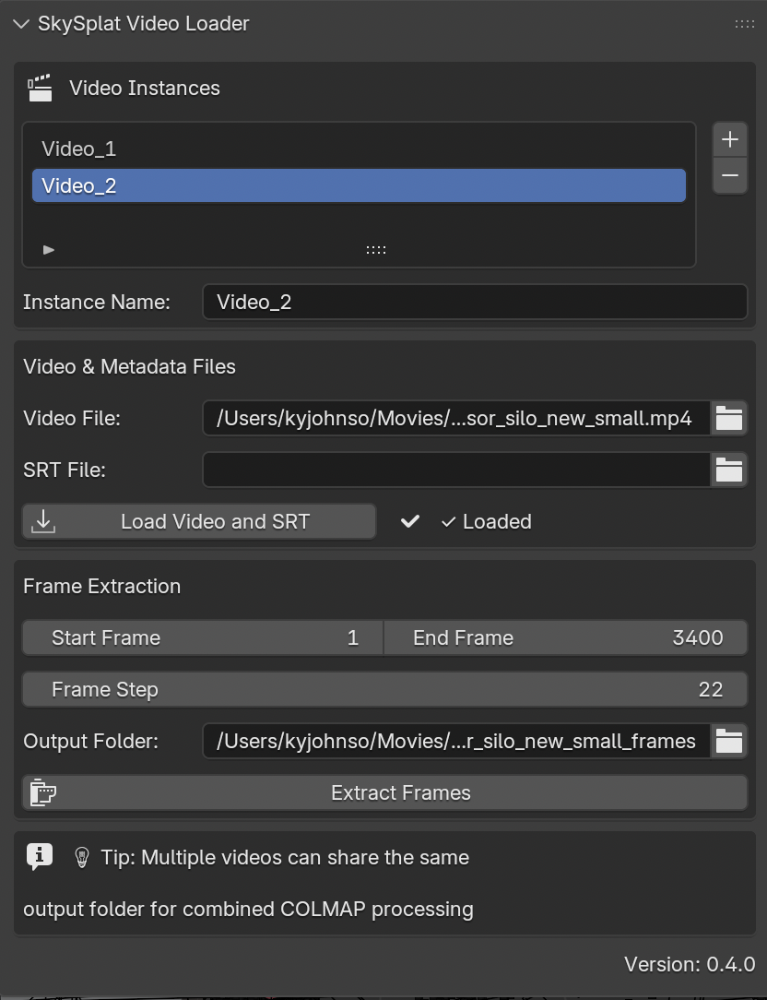
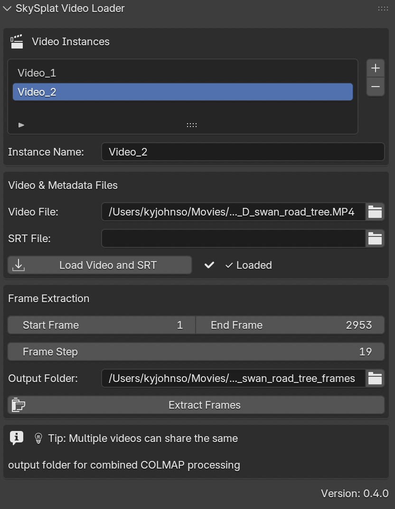
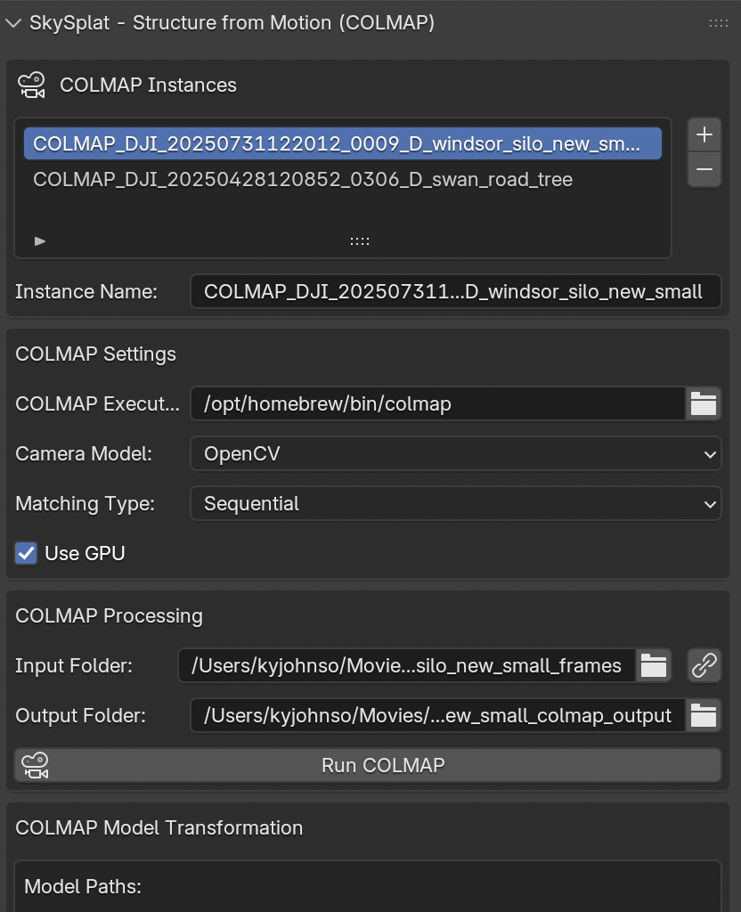
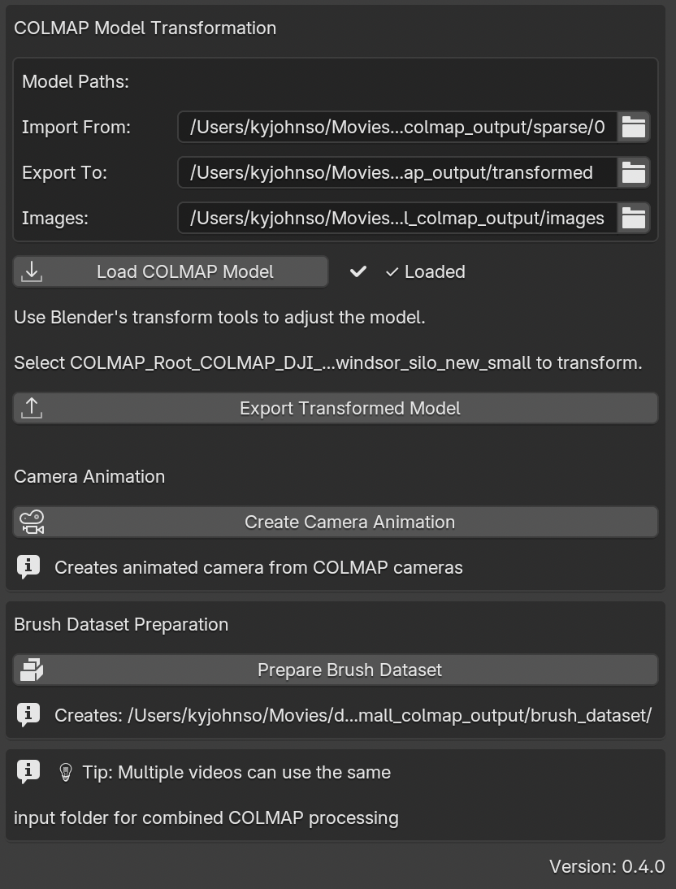
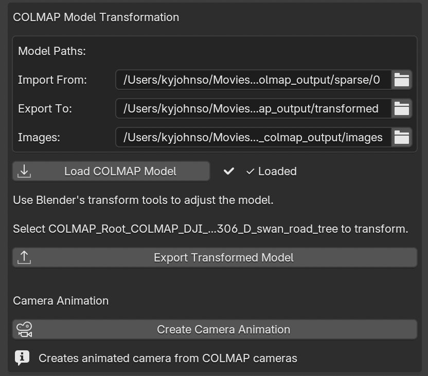
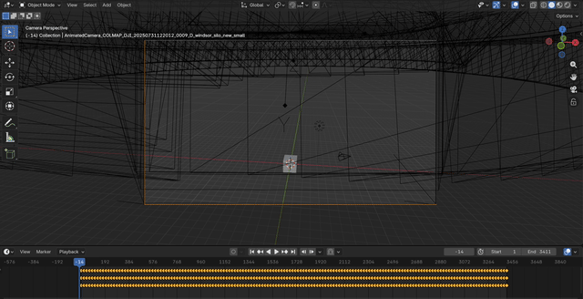
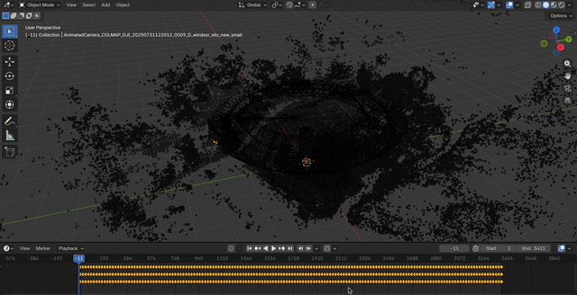
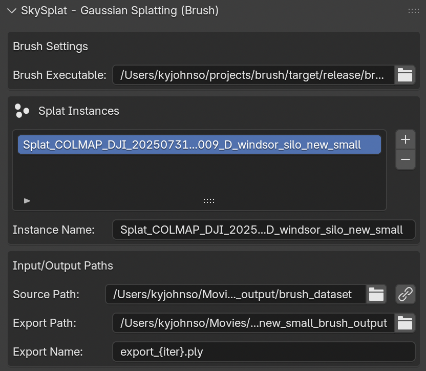
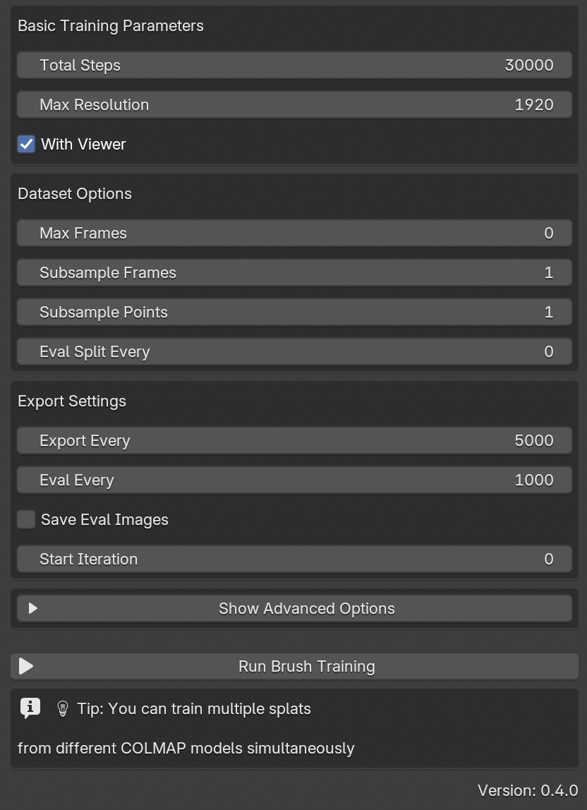

# SkySplat: 3DGS Blender Toolkit

SkySplat is a comprehensive Blender addon that streamlines the complete workflow for creating 3D Gaussian Splats from drone footage. **Now with full multi-instance support and Blender 5.0 compatibility**, SkySplat provides a seamless pipeline from video import through frame extraction, COLMAP reconstruction, model transformation, camera animation, and Gaussian Splatting training - all within Blender.

**✨ New in Version 0.4.0: Multi-Instance Workflow**

In version 0.3.0 and earlier, if you wanted to process different scenes in the same blend file you had to manually rename, move, and sort through the automatically created files. Now in v0.4.0 you can process multiple videos in the same .blend file without any file collisions! Each panel (Video, COLMAP, Brush) now supports multiple independent instances, allowing you to:
- Load and extract frames from multiple drone videos
- Run COLMAP processing on different datasets
- Transform and export multiple COLMAP models independently
- Train multiple Gaussian Splat models

All with automatic path management ensuring no conflicts between projects.

Also, now in version 0.4.0 you can automatically animate a camera to follow the COLMAP cameras and create key frames. This enables you to make sweet transition videos between the captured video and the rendered 3dgs.


## Key Features

### 🎬 Multi-Instance Video Management
- **Load multiple videos** with independent settings and frame extraction parameters
- **Video instances** maintain separate paths and configurations
- Automatic detection and loading of SRT metadata files per video
- Smart path management prevents file collisions between projects



### 📸 Flexible Frame Extraction
- Extract frames from multiple videos with customizable parameters (start, end, step)
- Automatic output folder creation based on video filename
- Independent frame extraction settings per video instance
- Optimized for aerial footage processing



### 🎯 Multi-Instance COLMAP Integration
- **Multiple COLMAP instances** - process different datasets
- Each instance maintains independent input/output paths
- No file conflicts when processing multiple reconstructions
- Path synchronization between video processing and reconstruction
- Support for both sequential and exhaustive matching



### 🔄 COLMAP Model Transformation
- Load COLMAP sparse reconstructions directly into Blender
- Scale, rotate, and translate models in Blender's 3D environment
- Export transformed models for Gaussian Splatting training
- Multiple COLMAP instances can be transformed independently
- Natural coordinate system alignment for better results



### 🎥 **NEW: Animated Camera Creation**
- **Automatically create animated cameras** from COLMAP camera positions
- Camera keyframes aligned to each reconstructed frame
- Smooth quaternion-based rotation interpolation (no gimbal lock!)
- Automatic camera resolution matching from COLMAP data
- Perfect for creating flythrough animations or previewing reconstructions





*Camera animation from COLMAP reconstruction - camera view*



*Camera animation from COLMAP reconstruction - outside perspective*

### 🌟 Multi-Instance Gaussian Splatting (Brush)
- **Multiple splat instances** - train different models
- Integration with Arthur Brussee's [Brush App](https://github.com/ArthurBrussee/brush)
- Pre-compiled binaries available for all platforms
- Independent training parameters per splat instance
- Brush dataset preparation with automatic path linking
- Real-time training viewer option
- No file conflicts between training sessions


</br>


## Requirements

- **Blender 5.0 or newer** (also compatible with Blender 4.0+)
- COLMAP (for reconstruction features)
- [Brush App](https://github.com/ArthurBrussee/brush) binaries (bundled with releases)

## Installation

### 1. Download and Install SkySplat

1. Download the latest release zip file from [SkySplat Releases](https://github.com/kyjohnso/skysplat_blender/releases/latest)

   **OR**

   Download the latest development version via the GitHub Download ZIP link under the code button at [skysplat_blender](https://github.com/kyjohnso/skysplat_blender)

   

2. Open Blender and navigate to Edit → Preferences → Add-ons
3. Click "Install..." and select the downloaded ZIP file
4. Enable the addon by checking the box next to "3D View: SkySplat: 3DGS Blender Toolkit"

### 2. Install COLMAP

[COLMAP](https://colmap.github.io/) is required for the Structure from Motion reconstruction features. Choose the installation method for your operating system:

#### macOS (Recommended: Homebrew)
```bash
brew install colmap
```
The executable will be installed to `/opt/homebrew/bin/colmap` (Apple Silicon) or `/usr/local/bin/colmap` (Intel).

#### Linux (Package Manager)
**Ubuntu/Debian:**
```bash
sudo apt update
sudo apt install colmap
```

**Fedora/RHEL:**
```bash
sudo dnf install colmap
```

**Arch Linux:**
```bash
sudo pacman -S colmap
```

The executable will typically be installed to `/usr/bin/colmap`.

#### Windows (Pre-compiled Binary)
1. Download the latest Windows release from [COLMAP GitHub Releases](https://github.com/colmap/colmap/releases)
2. Extract the ZIP file to a location like `C:\Program Files\COLMAP\`
3. The executable will be at `C:\Program Files\COLMAP\bin\colmap.exe`
4. Optionally, add the `bin` directory to your system PATH for easier access

**Note:** For SkySplat to work properly, you'll need to know the path to the COLMAP executable. The addon will attempt to auto-detect common installation paths, but you can manually specify the path in the COLMAP panel if needed.

### 3. Fix Brush Binary Permissions

Brush binaries are bundled with the addon for all platforms. On macOS and Linux, you need to make them executable and may need to remove quarantine attributes.

#### macOS

```bash
# Navigate to the addon binaries directory
cd ~/Library/Application\ Support/Blender/5.0/scripts/addons/skysplat_blender/binaries/

# Make executable
chmod +x brush_app_mac

# Remove quarantine attribute (if you get "Apple could not verify" error)
xattr -d com.apple.quarantine brush_app_mac
```

#### Linux

```bash
# Navigate to the addon binaries directory
cd ~/.config/blender/5.0/scripts/addons/skysplat_blender/binaries/

# Make executable
chmod +x brush_app_linux
```

#### Windows

No additional steps required - the `.exe` file should work directly.

#### Alternative: Build from Source

For the most up-to-date version or if you want to modify the source code:

1. **Install Rust** (if not already installed):
   ```bash
   curl --proto '=https' --tlsv1.2 -sSf https://sh.rustup.rs | sh
   source ~/.cargo/env
   ```

2. **Clone and build Brush**:
   ```bash
   git clone https://github.com/ArthurBrussee/brush.git
   cd brush
   cargo build --release
   ```

3. **Locate the executable**:
   - **Windows**: `target/release/brush_app.exe`
   - **macOS/Linux**: `target/release/brush_app`

**Important**: You will need to know the full path to the compiled executable (e.g., `/home/username/brush/target/release/brush_app`) as you'll need to specify this path in the SkySplat 3DGS panel's "Brush Executable" field.

**Note**: The SkySplat addon will automatically attempt to detect the bundled binaries first, then fall back to common build locations like `~/projects/brush/target/release/brush_app`. If none are found, you can manually specify the path in the 3DGS panel.

---

## Running Blender from Command Line

To monitor the detailed output of COLMAP processing, Brush training, and other operations, it's recommended to run Blender from the command line. This allows you to see real-time console output and debug information that isn't visible in the Blender GUI.

### Command Line Usage

**macOS:**
```bash
/Applications/Blender.app/Contents/MacOS/Blender
```

**Linux:**
```bash
blender
```

**Windows:**
```cmd
"C:\Program Files\Blender Foundation\Blender 5.0\blender.exe"
```

### Benefits of CLI Usage

- **COLMAP Output**: See detailed reconstruction progress, feature detection statistics, and any error messages
- **Brush Training**: Monitor training iterations, loss values, and performance metrics in real-time
- **Debug Information**: View Python error traces and addon-specific logging
- **Process Monitoring**: Track subprocess execution and completion status

When running operations like "Run COLMAP" or "Run Brush Training", the detailed output will appear in the terminal where you launched Blender, making it much easier to troubleshoot issues or monitor progress.

---

## Multi-Instance Workflow Example

This example demonstrates the power of SkySplat's multi-instance workflow, allowing you to manage multiple drone videos in the same .blend file without any file collisions.

### 1. Accessing the Toolkit
- Open the sidebar in the 3D View (press N)
- Select the "SkySplat" tab

### 2. Setting Up Multiple Video Instances
- Click the **"+"** button in the Video Instances section to add a new video instance
- Repeat for each video you want to process (e.g., Video_1, Video_2)
- Select the active instance you want to work with
- Each instance maintains independent settings and file paths


### 3. Loading Videos and Extracting Frames
For each video instance:
- You can download the example video used in this walkthrough at [windsor_silo](https://skysplat.net/DJI_20250731122012_0009_D_windsor_silo_new_small.mp4) (right click and save as)
- Select your video file in the "Video File" field
- SRT metadata files are detected automatically
- Click "Load Video and SRT" to import into the Video Sequencer
- Set frame range and step value (SkySplat auto-calculates optimal frame step)
- Click "Extract Frames" - output folders are automatically organized by video name
- **No file collisions**: Each video instance has its own output folder

### 4. Multi-Instance COLMAP Processing
Switch to the COLMAP panel:
- Click **"+"** to add COLMAP instances for each video
- Each COLMAP instance links to a video instance
- Click the chain link icon to auto-populate paths from video instances
- Configure COLMAP settings (camera model, matching type, GPU usage)
- Click "Run COLMAP" for each instance
- **No file conflicts** between different COLMAP instances


### 5. Transform Multiple COLMAP Models
For each COLMAP instance:
- Click "Load COLMAP Model" to import the reconstruction
- Each model loads into its own collection (e.g., COLMAP_Video1, COLMAP_Video2)
- Transform the "COLMAP_Root" object for each model independently
- Scale, rotate, and translate to align with your coordinate system
- Use reference images or models for proper scaling
- Click "Export Transformed Model" when satisfied
- **All models coexist in Blender** without interfering with each other


### 6. Create Animated Cameras
For each loaded COLMAP model:
- Click **"Create Camera Animation"** in the Camera Animation section
- SkySplat automatically:
  - Parses frame numbers from COLMAP camera names
  - Creates an animated camera (AnimatedCamera_InstanceName)
  - Sets camera resolution from COLMAP data
  - Creates keyframes at each frame with smooth quaternion interpolation
  - Sets the camera as active
- **Multiple animated cameras** can coexist, one per COLMAP instance
- Preview your reconstruction path with smooth motion


### 7. Multi-Instance Brush Training
Switch to the Gaussian Splatting (Brush) panel:
- Click "Prepare Brush Dataset" for each COLMAP instance
- This creates properly structured datasets (e.g., brush_dataset_1, brush_dataset_2)
- Click **"+"** to add Splat instances
- Each splat instance automatically links to its prepared dataset
- Configure training parameters independently per instance
- Click "Run Brush Training" for each splat
- **No file conflicts** between different training instances
- Monitor each training session separately


### 8. Loading 3D Gaussian Splats
There is already a rich Blender addon ecosystem for loading 3D gaussian splats into Blender. I recommend [KIRI Innovation's 3DGS Render Addon](https://github.com/Kiri-Innovation/3dgs-render-blender-addon).
- Load each .ply file from the export paths
- **Multiple splats coexist** in Blender's scene
- Each splat aligns with its transformed COLMAP model
- Create renders and animations with multiple splats


## Benefits of Multi-Instance Workflow

✅ **Manage multiple videos in one .blend file** - process different scenes without file conflicts
✅ **No file collisions** - automatic path management per instance
✅ **Independent settings** - different camera models, frame steps, training parameters
✅ **Organized projects** - each instance maintains its own folder structure
✅ **Streamlined workflow** - all models coexist in Blender without interfering
✅ **Scene management** - switch between different video projects easily

## Single-Instance Workflow

Of course, you can still use SkySplat for single video workflows! The multi-instance system is optional - simply use one instance per panel for a streamlined single-video experience, just like previous versions.

## Contributing

The best thing someone can do is try this workflow with their own drone videos and please tell me about your experience. This is still and early project and I know with an engaged open source community we can create some amazing splats, renders, experiences and art.


This development has been tested on macOS (Apple Silicon) with Blender 5.0, but the code is designed to be platform-agnostic. I would love if people wanted to try this out on Windows or Linux and could provide feedback or contribute to the project.

If you have any ideas for further features, bug reports, or want to help work on documentation, please feel free to fork the code and send a pull request or reach out.

## License

SkySplat_blender is licensed under the MIT License. A single file was forked from [COLMAP](https://colmap.github.io/) (utils/read_write_model.py) and it retains the original copyright.

Brush is built separately and no code is included in SkySplat. Also, it is licensed under Apache v2, and this license should be adhered to.

None of the code from [Gaussian Splatting](https://github.com/graphdeco-inria/gaussian-splatting) is included in this repo, however, if you use it all of its copyright and license conditions should be adhered to.

## Version History

**Version 0.4.0** (Current)
- ✅ **Multi-instance support** for Video, COLMAP, and Brush panels
- ✅ **Animated camera creation** from COLMAP cameras with smooth quaternion interpolation
- ✅ **Blender 5.0 compatibility** (also works with Blender 4.0+)
- ✅ **No file collisions** - independent path management per instance
- ✅ **Organized workflow** - manage multiple projects in one .blend file

**Version 0.3.0**
- ✅ Packaged Brush app binaries with the addon
- ✅ Automatic frame step calculation for optimal frame extraction

## Future Work

1. Integration of SRT metadata for improved COLMAP initialization
2. Batch processing UI enhancements
3. Direct integration with more 3D Gaussian Splatting viewers
4. Enhanced multi-instance monitoring and progress tracking


## Acknowledgments

Without these open source (or source available in one case) projects, I would have nothing in this project. If you find this workflow useful, please consider giving these projects a star or following them on GitHub to stay updated with their development.

- [Blender](https://www.blender.org/)
- [COLMAP](https://colmap.github.io/)
- [Brush App](https://github.com/ArthurBrussee/brush) - Current preferred implementation for 3dgs
- [Gaussian Splatting](https://github.com/graphdeco-inria/gaussian-splatting) - Original source for performing Gaussian Splatting
- [RedShot AI Tutorial](https://www.reshot.ai/3d-gaussian-splatting) - I used this tutorial extensively as I was working my way through my first gaussian splats
- [KIRI Innovation's 3DGS Render Addon](https://github.com/Kiri-Innovation/3dgs-render-blender-addon)

Happy Splatting!🎨

Kyjohnso


---

### Legacy - Install GraphDeco-INRIA's [gaussian-splatting](https://github.com/graphdeco-inria/gaussian-splatting) python package

The original SkySplat addon used the GraphDeco-INRIA's gaussian-splatting software. These install instructions are provided for completeness.

   1. clone the repository
   ```
   git clone git@github.com:graphdeco-inria/gaussian-splatting.git --recursive
   cd gaussian-splatting
   ```
   2. Virtual Environment - I highly recommend installing the gaussian-splatting software in a virtual environment to avoid conflicts with other python packages you may have installed. Here is how you would create and activate a virtual environment in bash:
   ```
   python3 -m venv venv
   source venv/bin/activate
   ```
### 3. Install the python dependencies
   ```
   pip install plyfile tqdm
   ````
   The submodules in the gaussian splatting repository depend on torch. You can install torch a variety of ways, but I find it most continent to install it via pip, just like the other dependencies. We will give pip a index url that is for your specific CUDA version (in this example I am installing 12.6). You can find your specific CUDA version by running;
   ```
   nvcc --version
   ```
   Then install torch via pip;
   ```
   pip install torch --index-url https://download.pytorch.org/whl/cu126
   ```

   At this point, I find it useful to verify that the installed torch version is compatible with your CUDA version and GPU. You can run the following commands in a python interpreter or put them in a file and run it.

   ```
   #!/usr/bin/env python3.11
   verify_cuda_torch.py

   import torch

   if torch.cuda.is_available():
      print("CUDA is available! You have", torch.cuda.device_count(), "GPU(s).")
      print("Device name:", torch.cuda.get_device_name(0))
   else:
      print("CUDA is not available. Check your installation.")
   ```

   Note: I have occasionally had problems with creating a venv, activating it, and then the python command pointing to a different version of python. Depending on your version of python and how you setup your environment, you may need to adjust how you call this file that you just created. For instance, I called the above file with the command:
   ```
   python3.11 verify_cuda_torch.py
   ```
   If you encounter issues, try creating a new venv and reinstalling torch there.

   Now you should be able to install the gaussian-splatting dependencies:
   ```
   pip install submodules/diff-gaussian-rasterization
   pip install submodules/simple-knn
   ```
   Make note of where you cloned the code to and where the virtual environment directory is located, these will be needed in blender to call the gaussian-splatting software
