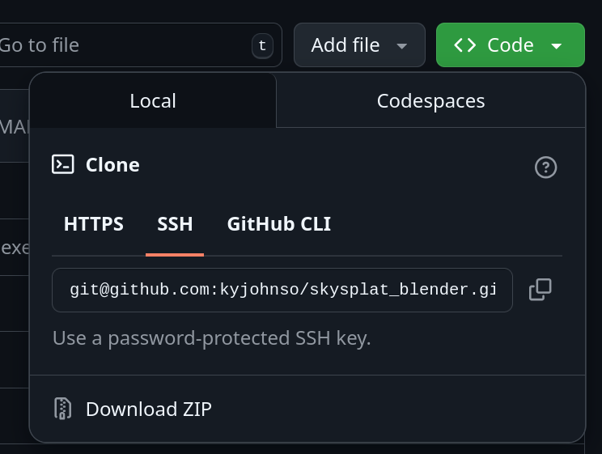

# SkySplat: 3DGS Blender Toolkit

SkySplat is a Blender addon that simplifies the workflow for creating 3D Gaussian Splats from drone footage. It provides a comprehensive set of tools to streamline the process from video import to frame extraction, and loose integration of Blender with COLMAP and GraphDeco-INRIA's gaussian splatting repo.

## Features

- **Video Import & Management**
  - Load drone videos directly into Blender
  - Automatic detection and loading of SRT metadata files
  - Smart path management for project organization

  

- **Automatic Frame Extraction**
  - Extract frames with customizable parameters (start, end, step)
  - Automatic output folder creation based on video filename
  - Optimized for aerial footage processing

  

- **COLMAP Integration**
  - A loose integration between COLMAP and Blender, arrange files and launch COLMAP from Blender
  - Path synchronization between video processing and reconstruction

  

- **Gaussian Splatting Integration**
  - A loose integration of GraphDeco-INRIA's [gaussian-splatting](https://github.com/graphdeco-inria/gaussian-splatting) repository.
  - Configuration of gaussian-splatting training from Blender
  - Running of gaussian-splatting in a subprocess

  

## Requirements

- Blender 4.0.0 or newer
- COLMAP (for reconstruction features)
- [Gaussian Splatting](https://github.com/graphdeco-inria/gaussian-splatting)

## Installation

1. Install COLMAP - [COLMAP](https://colmap.github.io/) Structure From Motion library and application is available from a wide variety of OS repositories. You can also download it and build it from source per the instructions on their home page. For calling from skysplat_blender, the path to the colmap executable will need to be known.

2. Install GraphDeco-INRIA's [gaussian-splatting](https://github.com/graphdeco-inria/gaussian-splatting) python package
   1. clone the repository
   ```
   git clone git@github.com:graphdeco-inria/gaussian-splatting.git --recursive
   cd gaussian-splatting
   ```
   2. Create a virtual environment to separate from your os python environment
   ```
   python3 -m venv venv
   source venv/bin/activate
   ```
   3. Pip install the dependencies
   ```
   pip install plyfile tqdm
   pip install submodules/diff-gaussian-rasterization
   pip install submodules/simple-knn
   ```
   4. Note where you cloned the code to and where the virtual environment directory is located, these will be needed in blender to call the gaussian-splatting software

2. Download the latest release from code button (see below)



3. Open Blender and navigate to Edit → Preferences → Add-ons
4. Click "Install..." and select the downloaded ZIP file
5. Enable the addon by checking the box next to "3D View: SkySplat: 3DGS Blender Toolkit"

## Example Workflow Run Through

1. **Accessing the Toolkit**
   - Open the sidebar in the 3D View (press N)
   - Select the "SkySplat" tab

2. **Loading Drone Footage**
   - Select your video file in the "Video File" field
   - If available, the SRT metadata file will be detected automatically
   - Click "Load Video and SRT" to import into the Video Sequencer

3. **Extracting Frames**
   - Set your desired frame range and step value
   - Confirm or modify the output folder
   - Click "Extract Frames" to process

4. **COLMAP Workflow**
   - Configure COLMAP settings in the dedicated panel
   - Process extracted frames through the integrated COLMAP workflow

## Workflow

SkySplat is designed to simplify the journey from drone video to 3D Gaussian Splats:

1. Import drone footage with GPS data
2. Extract optimal frames for reconstruction
3. Process through COLMAP integration
4. Generate 3D Gaussian Splats
5. Visualize and refine in Blender

## Contributing

Contributions are welcome! If you'd like to improve SkySplat:

1. Fork the repository
2. Create your feature branch (`git checkout -b feature/amazing-feature`)
3. Commit your changes (`git commit -m 'Add some amazing feature'`)
4. Push to the branch (`git push origin feature/amazing-feature`)
5. Open a Pull Request

## License

MIT License

## Acknowledgments

- [Blender](https://www.blender.org/)
- [COLMAP](https://colmap.github.io/)
- [Gaussian Splatting](https://github.com/graphdeco-inria/gaussian-splatting)
- [RedShot AI Tutorial](https://www.reshot.ai/3d-gaussian-splatting)