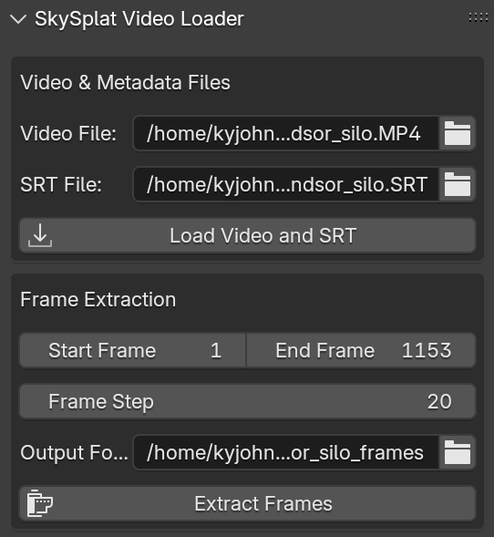

# SkySplat: 3DGS Blender Toolkit

SkySplat is a Blender addon that simplifies the workflow for creating 3D Gaussian Splats from drone footage. It provides a comprehensive set of tools to streamline the process from video import to frame extraction, and loose integration of Blender with COLMAP and GraphDeco-INRIA's gaussian splatting repo.


## Features

- **Video Import & Management**
  - Load drone videos directly into Blender
  - Automatic detection and loading of SRT metadata files
  - Smart path management for project organization

  

- **Automatic Frame Extraction**
  - Extract frames with customizable parameters (start, end, step)
  - Automatic output folder creation based on video filename
  - Optimized for aerial footage processing

  

- **COLMAP Integration**
  - A loose integration between COLMAP and Blender, arrange files and launch COLMAP
  - Path synchronization between video processing and reconstruction

  

- **Gaussian Splatting Integration**
  - A loose integration of GraphDeco-INRIA's [gaussian-splatting](https://github.com/graphdeco-inria/gaussian-splatting) repository.
  - Configuration of gaussian-splatting training from Blender
  - Running of gaussian-splatting in a subprocess

  

## Requirements

- Blender 4.0.0 or newer
- COLMAP (for reconstruction features)
- [Gaussian Splatting](https://github.com/graphdeco-inria/gaussian-splatting)

## Installation

### 1. Install COLMAP
   1. [COLMAP](https://colmap.github.io/) Structure From Motion library and application is available from a wide variety of OS repositories. You can also download it and build it from source per the instructions on their home page. For calling from skysplat_blender, the path to the colmap executable will need to be known.

### 2. Install Brush (Rust based Gaussian Splatting)

#### Prerequisites
- [Rust](https://rustup.rs/) - Install the Rust programming language and Cargo package manager
- Git

#### Building Brush

1. **Clone the Brush Repository**
   ```bash
   git clone https://github.com/ArthurBrussee/brush.git
   cd brush
   ```

2. **Build for Your Platform**

   **Linux:**
   ```bash
   # Install Rust if not already installed
   curl --proto '=https' --tlsv1.2 -sSf https://sh.rustup.rs/ | sh
   source ~/.cargo/env
   
   # Build the application
   cargo build --release
   
   # The executable will be at: target/release/brush_app
   ```

   **Windows:**
   ```cmd
   # Install Rust from https://rustup.rs/
   # Then in Command Prompt or PowerShell:
   
   cargo build --release
   
   # The executable will be at: target\release\brush_app.exe
   ```

   **macOS:**
   ```bash
   # Install Rust if not already installed
   curl --proto '=https' --tlsv1.2 -sSf https://sh.rustup.rs/ | sh
   source ~/.cargo/env
   
   # Build the application
   cargo build --release
   
   # The executable will be at: target/release/brush_app
   ```

### 2 (a). Legacy - Install GraphDeco-INRIA's [gaussian-splatting](https://github.com/graphdeco-inria/gaussian-splatting) python package

The original SkySplat addon used the GraphDeco-INRIA's gaussian-splatting software. These install instructions are provided for completeness.

   1. clone the repository
   ```
   git clone git@github.com:graphdeco-inria/gaussian-splatting.git --recursive
   cd gaussian-splatting
   ```
   2. Virtual Environment - I highly recommend installing the gaussian-splatting software in a virtual environment to avoid conflicts with other python packages you may have installed. Here is how you would create and activate a virtual environment in bash:
   ```
   python3 -m venv venv
   source venv/bin/activate
   ```
### 3. Install the python dependencies
   ```
   pip install plyfile tqdm
   ````
   The submodules in the gaussian splatting repository depend on torch. You can install torch a variety of ways, but I find it most continent to install it via pip, just like the other dependencies. We will give pip a index url that is for your specific CUDA version (in this example I am installing 12.6). You can find your specific CUDA version by running;
   ```
   nvcc --version
   ```
   Then install torch via pip;
   ```
   pip install torch --index-url https://download.pytorch.org/whl/cu126
   ```

   At this point, I find it useful to verify that the installed torch version is compatible with your CUDA version and GPU. You can run the following commands in a python interpreter or put them in a file and run it.

   ```
   #!/usr/bin/env python3.11
   verify_cuda_torch.py

   import torch

   if torch.cuda.is_available():
      print("CUDA is available! You have", torch.cuda.device_count(), "GPU(s).")
      print("Device name:", torch.cuda.get_device_name(0))
   else:
      print("CUDA is not available. Check your installation.")
   ```
   
   Note: I have occasionally had problems with creating a venv, activating it, and then the python command pointing to a different version of python. Depending on your version of python and how you setup your environment, you may need to adjust how you call this file that you just created. For instance, I called the above file with the command:
   ```
   python3.11 verify_cuda_torch.py
   ```
   If you encounter issues, try creating a new venv and reinstalling torch there.

   Now you should be able to install the gaussian-splatting dependencies:
   ```
   pip install submodules/diff-gaussian-rasterization
   pip install submodules/simple-knn
   ```
   Make note of where you cloned the code to and where the virtual environment directory is located, these will be needed in blender to call the gaussian-splatting software

### 3. Download the latest release
   You can either download the latest version of the code, via the GitHub Download ZIP link under the code button at [skysplat_blender](https://github.com/kyjohnso/skysplat_blender) (shown below), or download a release zip file from [skysplat_blender.zip](https://github.com/kyjohnso/skysplat_blender/releases/download/v0.2.0/skysplat_blender.zip).


3. Open Blender and navigate to Edit → Preferences → Add-ons
4. Click "Install..." and select the downloaded ZIP file
5. Enable the addon by checking the box next to "3D View: SkySplat: 3DGS Blender Toolkit"
---
## Example Workflow Run Through

1. **Accessing the Toolkit**
   - Open the sidebar in the 3D View (press N)
   - Select the "SkySplat" tab

2. **Loading Drone Footage**
   - You can download the example video used in this walkthrough at [windsor_silo](https://skysplat.net/DJI_20240730101124_0020_D_windsor_silo.MP4) (right click and save as)
   - Select your video file in the "Video File" field in the 3D Viewport
   - If available, the SRT metadata file will be detected automatically
   - Click "Load Video and SRT" to import into the Video Sequencer



3. **Extracting Frames**
   - Set your desired frame range and step value
   - Confirm or modify the output folder
   - Click "Extract Frames" to process

4. **COLMAP Workflow**
   - Configure COLMAP settings in the SkySplat COLMAP panel
   - COLMAP Executable should auto populate with your systems default path, however you can manually set it if needed
   - If the input and output paths for the models aren't loaded, you can click the chain link icon to auto populate them from the video file path and defaults.
   - The defaults for the other settings should be sufficient for your first few runs. 
   - Click "Run COLMAP" to begin processing your video frames into a sparse point cloud (you can monitor the console running blender for detailed colmap output)


5. **COLMAP Model Transformation**
   This step was the main reason I came up with this workflow. COLMAP will default the coordinate frame to the frame of the initial camera pose. This means that for many gaussian splatting drone videos, it is slightly tilted down and at the first camera origin, rather than being at a natural center of the scene. This panel lets you load the COLMAP output model, scale, rotate, and translate the parent object in blender to a more natural scale, position, and orientation, and then export the model before gaussian splatting training.
   - Click "Load COLMAP Model" after running COLMAP (future versions will make explicit the location of the model to load from, however for now it is the same location as the output of COLMAP that you selected above). Note that the defaults of Transform on Import and Transform on Export are not selected by default, because we are transforming the COLMAP model in blender, we don't necessarily need the addon to do any transformations for us. This will however leave the imported cameras facing the wrong direction but this does not affect the subsequent 3DGS training. 

   

   - To transform this model, make sure you transform the parent "COLMAP_Root" empty object, not individual cameras or points. 

   

   - For the example silo video, I rotated it so the natural ground was in the X-Y plane, and the origin was at the base of the silo. 

   

   - This is where the true power of this workflow starts to shine. Because I have yet to incorporate the SRT file, and COLMAP is capable of SfM without explicit camera locations or parameters, the learned scene can be rather small. In this case I added a Blender mesh that is approximately the size of the silo in the scene, and then (again by selecting the COLMAP_Root empty) can scale the model to fit the points on the top of the silo to the top of the mesh silo.

   
   
   
   

   Now I can export the model scaled and rotated into a more natural coordinate system, and the 3DGS code will start with these parameters when it fits the gaussians.

    - Click "Export COLMAP Model" after you have finished transforming and adjusting your model, this will export a new model in the <colmap output directory>/transformed/ directory.

    - Click "Prepare Brush Dataset" to prepare a dataset for training with the Gaussian Splatting Brush. This will arrange your COLMAP model and images into a directory that brush can import.
   

6. **Brush Training (3D Gaussian Splatting)**
   - Configure Brush settings in the SkySplat 3DGS panel (as shown in the image below)
   - The Brush Executable path should auto-populate based on your platform's default location, but you can manually set it if needed
   - Use the chain link icon next to the Source Path to automatically sync with your COLMAP output
   - The Source Path should point to your transformed COLMAP model or prepared brush dataset
   - Set your Export Path where the trained .ply files will be saved
   - Configure training parameters:
     - **Total Steps**: Number of training iterations (default: 30000)
     - **Max Resolution**: Maximum image resolution for training (default: 1920)
     - **With Viewer**: Enable this to pop up the interactive viewer application that shows real-time training progress
   - Advanced options are available by expanding the "Show Advanced Options" section for fine-tuning learning rates, refinement parameters, and dataset options
   - Click "Run Brush Training" to start the process
   - Unlike the original Gaussian Splatting implementation, Brush runs as a subprocess so it won't block the Blender UI
   - Monitor progress in the Blender console, or if you enabled "With Viewer", watch the training progress in the dedicated viewer window
   - The training process will automatically export .ply files at specified intervals to your Export Path


7. **3DGS Loading**
   There is already a rich Blender addon ecosystem for loading 3D gaussian splats into Blender. I recommend [KIRI Innovation's 3DGS Render Addon](https://github.com/Kiri-Innovation/3dgs-render-blender-addon) and you can see it in my Blender screen shots above if you look closely. I recommend loading the ply file without transforming from COLMAP to Blender coordinates mainly because we already did a transformation and scaling in the previous step. If everything worked you will now have your transformed COLMAP model, any helper "reference silos" you created in blender, and the 3D Gaussian Splat ready to create whatever awesome render or animation you are working on. 


## Contributing

The best thing someone can do is try this workflow with their own drone videos and please tell me about your experience. This is the very first iteration of this and I know with an engaged open source community we can create some amazing splats, renders, experiences and art.


I did this development on Linux and while I tried (or more acurately Claude tried) to make sure it is platform agnostic, I would love if people wanted to try this out on Windows or MacOS and could provide feedback or contribute to the project. 

I also have many comments above to the effect of *"future versions will include..."*, and *"I still need to work on..."* etc.

If you have any ideas for further features, or bug reports, or want to help work on documentation, please feel free to fork the code and send a pull request or reach out.

## License

SkySplat_blender is licensed under the MIT License. A single file was forked from [COLMAP](https://colmap.github.io/) (utils/read_write_model.py) and it retains the original copyright. None of the code from [Gaussian Splatting](https://github.com/graphdeco-inria/gaussian-splatting) is included in this repo, however, we loosly integrate with it and all of its copyright and license conditions should be adhered to.


## Future Work

1. I am working on packaging the brush app with the blender addon to further simplify the install process.


## Acknowledgments

Without these open source (or source available in one case) projects, I would have nothing in this project. If you find this workflow useful, please consider giving these projects a star or following them on GitHub to stay updated with their development.


- [Blender](https://www.blender.org/)
- [COLMAP](https://colmap.github.io/)
- [Brush App](https://github.com/ArthurBrussee/brush) - Current preferred implementation for 3dgs
- [Gaussian Splatting](https://github.com/graphdeco-inria/gaussian-splatting) - Original source for performing Gaussian Splatting
- [RedShot AI Tutorial](https://www.reshot.ai/3d-gaussian-splatting)
- [KIRI Innovation's 3DGS Render Addon](https://github.com/Kiri-Innovation/3dgs-render-blender-addon)

Happy Splatting!🎨

Kyjohnso

